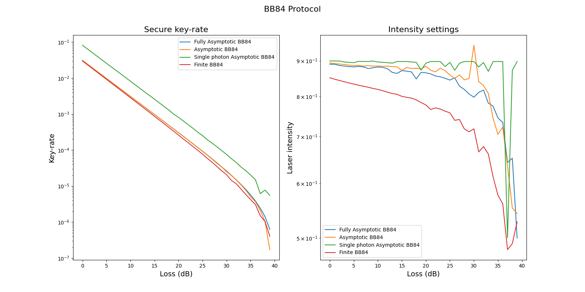
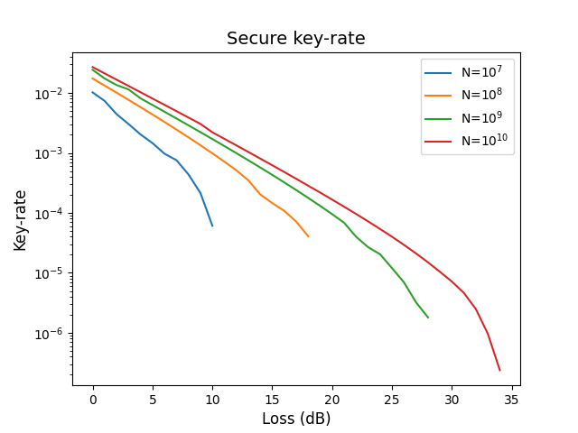

# TNO-Quantum: QKD key-rate

TNO Quantum provides generic software components aimed at facilitating the development of quantum applications.

The `tno.quantum.communication.qkd_key_rate` package provides python code to compute optimal protocol parameters for different quantum key distribution (QKD) protocols.

The codebase is based on the following papers:

- [Attema et al. - Optimizing the decoy-state BB84 QKD protocol parameters (2021)](https://doi.org/10.1007/s11128-021-03078-0)
- [Ma et al. - Quantum key distribution with entangled photon sources (2007)](http://doi.org/10.1103/PhysRevA.76.012307)


The following quantum protocols are supported:

- BB84 protocol,
- BB84 protocol using a single photon source,
- BBM92 protocol.

The following classical error-correction protocols are supported:

- Cascade,
- Winnow.

The presented code can be used to

- determine optimal parameter settings needed to obtain the maximum key rate, 
- correct errors in exchanged sifted keys for the different QKD protocols,
- apply privacy amplification by calculating secure key using hash function. 

*Limitations in (end-)use: the content of this software package may solely be used for applications that comply with international export control laws.*

## Documentation

Documentation of the `tno.quantum.communication.qkd_key_rate` package can be found [here](https://tno-quantum.github.io/communication.qkd_key_rate/)

## Install

Easily install the `tno.quantum.communication.qkd_key_rate` package using pip:
```console
$ python -m pip install tno.quantum.communication.qkd_key_rate
```

If you wish to run the tests you can use:
```console
$ python -m pip install tno.quantum.communication.qkd_key_rate[tests]
```

## Usage

<details>
  <summary>Compute secure key-rate.</summary>
The following code demonstrates how the BB84 protocol can be used to calculate optimal key-rate for a specific detector.

```python
from tno.quantum.communication.qkd_key_rate.protocols.quantum.bb84 import (
   BB84FullyAsymptoticKeyRateEstimate,
)
from tno.quantum.communication.qkd_key_rate.test.conftest import standard_detector

detector = standard_detector.customise(
    dark_count_rate=6e-7,
    polarization_drift=0.0707,
    error_detector=5e-3,
    efficiency_detector=0.1,
)

fully_asymptotic_key_rate = BB84FullyAsymptoticKeyRateEstimate(detector=detector)
mu, rate = fully_asymptotic_key_rate.optimize_rate(attenuation=0.2)
```
</details>

<details>
  <summary>Correct errors.</summary>
The following example demonstrates usage of the Winnow error correction protocol.

```python
import numpy as np

from tno.quantum.communication.qkd_key_rate.base import Message, Permutations, Schedule
from tno.quantum.communication.qkd_key_rate.protocols.classical.winnow import (
   WinnowCorrector,
   WinnowReceiver,
   WinnowSender,
)

error_rate = 0.05
message_length = 10000
input_message = Message.random_message(message_length=message_length)
error_message = Message(
   [x if np.random.rand() > error_rate else 1 - x for x in input_message]
)
schedule = Schedule.schedule_from_error_rate(error_rate=error_rate)
number_of_passes = np.sum(schedule.schedule)
permutations = Permutations.random_permutation(
   number_of_passes=number_of_passes, message_size=message_length
)

alice = WinnowSender(
   message=input_message, permutations=permutations, schedule=schedule
)
bob = WinnowReceiver(
   message=error_message, permutations=permutations, schedule=schedule
)
corrector = WinnowCorrector(alice=alice, bob=bob)
summary = corrector.correct_errors()
```
</details>

# Examples
The [examples](https://github.com/TNO-Quantum/examples) repository contain more elaborate examples that demonstrate possible usage

- How to compute the secure key-rate for various protocols as function of the loss. 


- How to compute secure key-rate using the finite key-rate protocol for different number of pulses.

