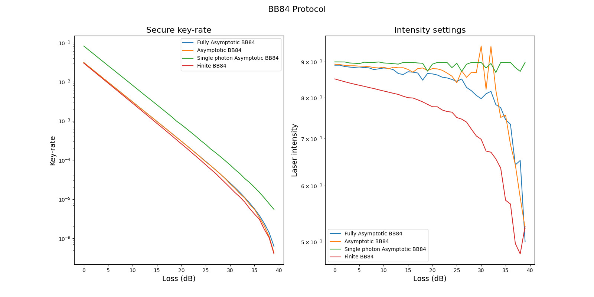

# TNO-Quantum: QKD key-rate

TNO Quantum provides generic software components aimed at facilitating the development of quantum applications.

The `tno.quantum.communication.qkd_key_rate` package provides python code to compute optimal protocol parameters for different quantum key distribution (QKD) protocols.

The codebase is based on the following papers:

- [Attema et al. - Optimizing the decoy-state BB84 QKD protocol parameters (2021)](https://doi.org/10.1007/s11128-021-03078-0)
- [Ma et al. - Quantum key distribution with entangled photon sources (2007)](http://doi.org/10.1103/PhysRevA.76.012307)


The following quantum protocols are supported:

- BB84 protocol,
- BB84 protocol using a single photon source,
- BBM92 protocol.

The following classical error-correction protocols are supported:

- Cascade,
- Winnow.

The presented code can be used to

- determine optimal parameter settings needed to obtain the maximum key rate, 
- correct errors in exchanged sifted keys for the different QKD protocols,
- apply privacy amplification by calculating secure key using hash function. 


## Documentation

Documentation of the `tno.quantum.communication.qkd_key_rate` package can be found [here](https://tno-quantum.github.io/documentation/).

The documentation contains usage examples that show

- How to compute the secure key-rate for various protocols as function of the loss. 


- How to compute secure key-rate using the finite key-rate protocol for different number of pulses.


## Install

Easily install the `tno.quantum.communication.qkd_key_rate` package using pip:
```console
$ python -m pip install tno.quantum.communication.qkd_key_rate
```

If you wish to run the tests you can use:
```console
$ python -m pip install tno.quantum.communication.qkd_key_rate[tests]
```

## (End)use limitations
The content of this software may solely be used for applications that comply with international export control laws.